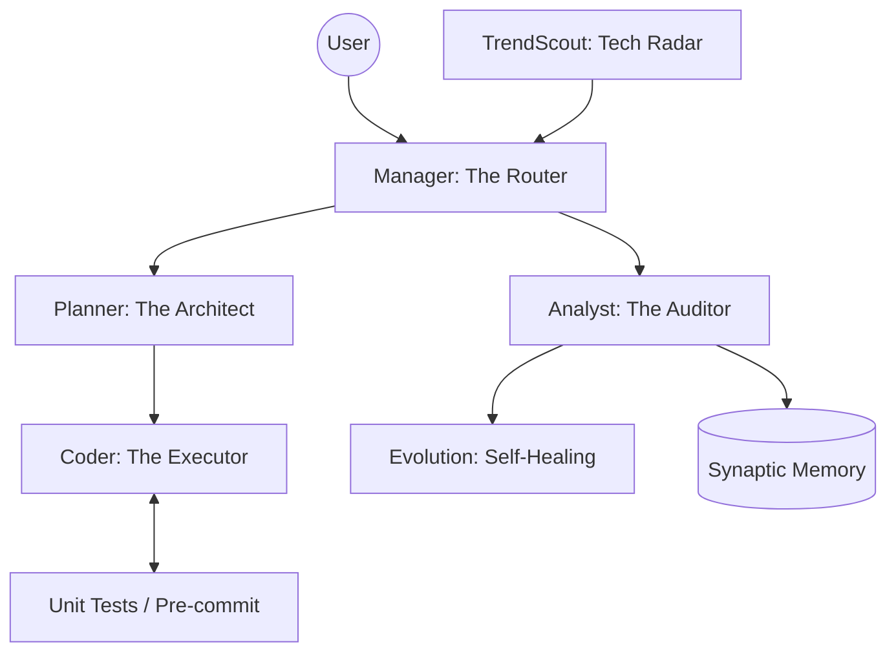

# 🧠 GORTEX: The Self-Evolving AI Partner

> **"잊지 않는 지능, 스스로를 고치는 시스템"**
> Gortex는 로컬 환경에서 동작하며, 사용자의 피드백과 스스로의 성공/실패 데이터를 바탕으로 끊임없이 진화하는 차세대 AI 운영 파트너입니다.

[](./VERSION)
[](LICENSE)
[](./docs/RULES.md)

---

## 🚀 Gortex의 차별점

### 1. 자가 진화 엔진 (Evolutionary Core)
Gortex는 단순히 코드를 작성하지 않습니다. 과거의 실수를 **명문화된 규칙(`experience.json`)**으로 승격시키고, `EvolutionNode`를 통해 시스템의 소스 코드와 아키텍처를 스스로 개선합니다.

### 2. 아키텍처 수호자 (Drift Guard & Self-Healing)
정적 분석 엔진이 실시간으로 프로젝트의 의존성 구조를 감시합니다. 레이어 원칙 위반이나 아키텍처 왜곡이 감지되면 시스템이 스스로 리팩토링을 수행하여 무결성을 회복합니다.

### 3. 지능형 전문가 함대 (Expert Routing)
작업의 복잡도와 과거 성과 데이터를 분석하여 최적의 모델을 할당합니다. 고차원 설계는 **Gemini 1.5 Pro**가, 반복적인 코딩 작업은 **Ollama(로컬 모델)**가 전담하는 효율적인 하이브리드 체계를 갖추고 있습니다.

### 4. 고강도 품질 헌법 (Strict TDD)
"No Test, No Code." 테스트 코드가 없거나 품질 검사를 통과하지 못한 코드는 결코 시스템에 병합될 수 없습니다. `pre_commit.sh`가 모든 커밋의 게이트키퍼 역할을 수행합니다.

---

## 🛠️ 핵심 아키텍처



---

## 📊 시각화 및 관측성 (TUI Dashboard)
Gortex는 블랙박스가 아닙니다. Rich 기반의 터미널 대시보드를 통해 에이전트의 사고 과정(**Thought Tree**), 아키텍처 건강도(**Health Score**), 그리고 진화 이력을 실시간으로 투명하게 공개합니다.

---

## 🏁 시작하기

### 환경 요구사항
*   **Python 3.10+**
*   **Gemini API Keys** (듀얼 키 로테이션 지원)
*   **Ollama** (로컬 모델 운영 시 필수)

### 빠른 설치 및 실행
```bash
# 1. 저장소 복제 및 초기화
git clone <repository-url>
cd gortex
bash setup.sh

# 2. 환경 변수 설정
cp .env.example .env
# GEMINI_API_KEY_1, _2 등을 입력하십시오.

# 3. 시스템 기동
python main.py
```

---

## 📜 문서 체계 (Canonical Docs)
Gortex의 모든 연속성은 파일로 보장됩니다.
*   [`SPEC_CATALOG.md`](./docs/SPEC_CATALOG.md): 시스템 정의 및 철학
*   [`TECHNICAL_SPEC.md`](./docs/TECHNICAL_SPEC.md): 상세 데이터 구조 및 명세
*   [`WORKFLOW.md`](./docs/WORKFLOW.md): 에이전트 행동 지침 및 워크플로우
*   [`RULES.md`](./docs/RULES.md): 절대 준수해야 할 프로젝트 규칙

---
*Developed & Evolved by Gortex Autonomous Protocol*