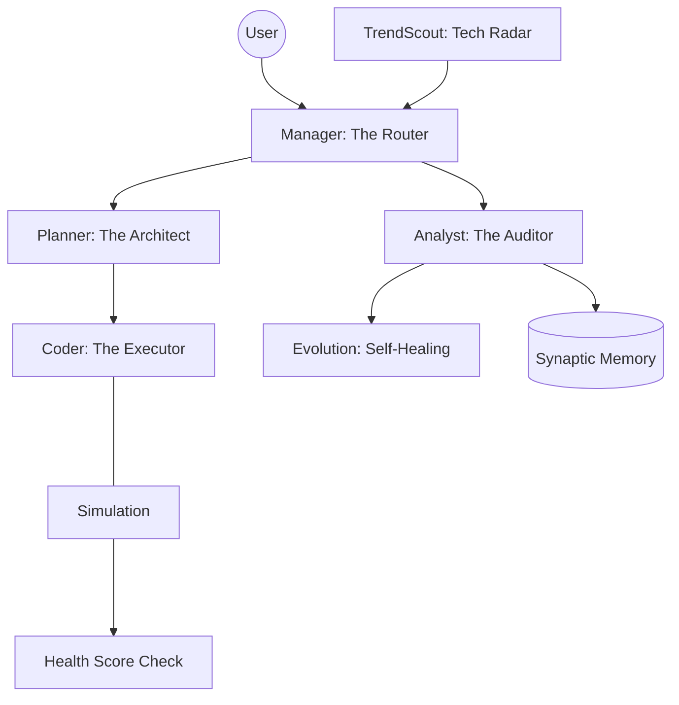

# 🧠 GORTEX: The Self-Evolving AI Partner

> **"잊지 않는 지능, 스스로를 고치는 시스템"**
> Gortex는 개발자와 기획자 모두를 위한 차세대 AI 운영 파트너입니다. 로컬 환경에서 동작하며, 사용자의 피드백과 스스로의 데이터를 바탕으로 끊임없이 아키텍처를 치유하고 기능을 진화시킵니다.

[](./VERSION)
[](./docs/RULES.md)
[](#-강력한-터미널-관측성-tui-dashboard)

---

## 🚀 "딸깍" 한 번으로 시작하기 (Quick Start)

Gortex는 복잡한 설정을 자동화하여 누구나 쉽게 시작할 수 있는 **One-Click 환경**을 제공합니다.

### 1. 시스템 기동
터미널에서 아래 단 한 줄의 명령어를 입력하십시오.
```bash
./start.sh
```
*   **자동 설정**: 가상환경(venv) 구축, 필수 패키지 설치, 브라우저 엔진(Playwright) 설정이 자동으로 진행됩니다.
*   **대화형 구성**: 설정 도중 **Gemini API 키**를 물어보면 입력해주시면 됩니다. (키가 이미 `.env`에 있다면 바로 실행됩니다.)

---

## 🌟 직군별 활용 시나리오

### 👨‍💼 기획자 & PM (Product Manager)
*   **기술 부채 진단**: `/scan_debt` 명령으로 서비스의 건강 상태를 점수화하여 리팩토링 시점을 판단합니다.
*   **영향 범위 분석**: "신규 기능을 추가하면 기존 코드의 어디가 수정되나요?"라고 물어보세요. `Planner`가 리스크를 분석해줍니다.
*   **규칙 준수 확인**: 우리가 과거에 정한 비즈니스/기술 규칙들이 코드에 잘 반영되고 있는지 실시간으로 모니터링합니다.

### 👨‍💻 개발자 & 엔지니어 (Engineer)
*   **자가 진화(Evolution)**: 에너지가 충분할 때 시스템이 스스로 코드를 리팩토링하고 신기술을 도입합니다.
*   **아키텍처 수호(Drift Guard)**: 레이어 원칙 위반이나 순환 참조를 감시하고 자동으로 치유(Self-Healing)합니다.
*   **하이브리드 LLM**: 설계는 **Gemini 1.5 Pro**, 반복 코딩은 **Ollama(로컬)**가 담당하여 비용과 성능을 최적화합니다.
*   **철저한 TDD**: 모든 코드는 `pre_commit.sh`를 통해 테스트 통과가 검증된 후 병합됩니다.

---

## 📚 상세 명령어 가이드 (User Guide)

Gortex TUI 대시보드 내에서 다음 슬래시 명령어를 사용할 수 있습니다.

| 명령어 | 설명 | 활용 팁 |
| :--- | :--- | :--- |
| `/help` | 모든 명령어 사용법 안내 | 기능이 기억나지 않을 때 가장 먼저 입력하세요. |
| `/status` | 토큰 사용량, 가상 에너지, 효율 보고 | 시스템의 리소스 소비 상태를 점검합니다. |
| `/search [어]` | 의미 기반(Semantic) 코드 검색 | "로그인 로직 어디 있어?"와 같이 자연어로 검색하세요. |
| `/map` | 전체 프로젝트 구조 트리 출력 | 프로젝트의 전체적인 클래스/함수 지도를 확인합니다. |
| `/scan_debt` | 기술 부채 및 코드 복잡도 분석 | 아키텍처 건강도(Health Score)의 근거를 확인합니다. |
| `/mode [mode]` | 화면 레이아웃 변경 | `coding`, `research`, `analyst` 등 상황에 맞게 전환하세요. |
| `/rca [id]` | 인과 관계(Root Cause) 역추적 | "왜 이런 판단을 내렸지?"에 대한 근거를 확인합니다. |
| `/language` | 언어 즉시 변경 (`ko` / `en`) | 에이전트의 응답 언어를 바꿉니다. |

---

## 🛠️ 시스템 아키텍처



---

## 📊 강력한 터미널 관측성 (TUI Dashboard)
Gortex는 블랙박스가 아닙니다. **Rich 라이브러리 기반의 TUI**를 통해 다음 정보를 실시간 공개합니다.
*   **Thought Tree**: 에이전트가 어떤 논리 단계를 거쳐 결론에 도달했는지 시각화.
*   **Health Score**: 아키텍처 위반, 복잡도를 점수화(0~100)하여 시스템 무결성 표시.
*   **Evolution History**: 최근 어떤 기술이 어떤 파일에 성공적으로 적용되었는지 기록.

---

## 📜 프로젝트 문서 체계 (Canonical Docs)
Gortex의 모든 장기 기억과 연속성은 아래 문서들로 관리됩니다.
*   [`docs/WORKFLOW.md`](./docs/WORKFLOW.md): 에이전트와 인간의 협업 행동 지침
*   [`docs/SPEC_CATALOG.md`](./docs/SPEC_CATALOG.md): 시스템의 존재 이유와 설계 철학
*   [`docs/RULES.md`](./docs/RULES.md): 커밋 및 품질 관리를 위한 절대 원칙
*   [`docs/release_note.md`](./docs/release_note.md): 누적된 진화 및 변경 기록

---
*Developed & Evolved by Gortex Autonomous Protocol*